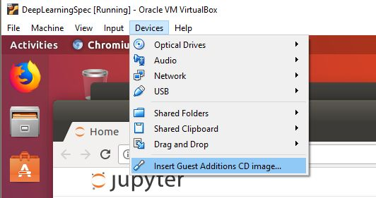
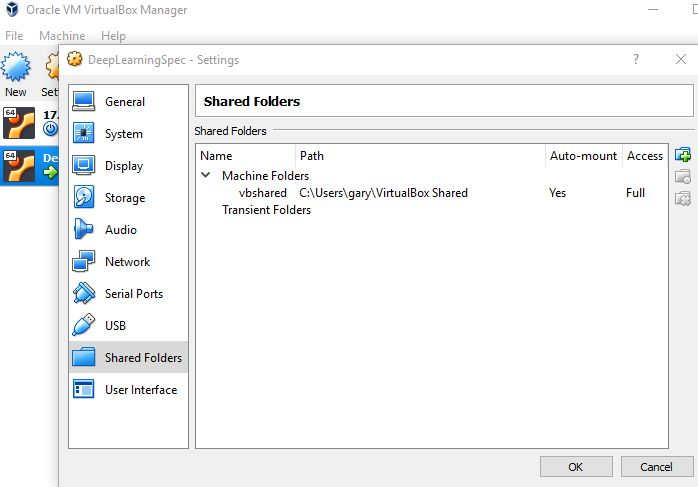

= Virtual Box Shared Folders
Gary Dalton <https://github.com/gary-dalton>
:description: How-to share a folder between the host and guest operating systems using Virtual Box.
:revnumber: 1.0
:revdate: 03 March 2018
:license: Creative Commons BY-SA
:homepage: https://gary-dalton.github.io/
:githubuser: gary-dalton
:githubrepo: my_support
:githubbranch: master
:icons: font
:toc: left
:toclevels: 4
:source-highlighter: highlightjs
:css: stylesheets/stylesheet.css
:linkcss:
:cli: asciidoctor -a stylesheet=github.css -a stylesdir=stylesheets vbox_share.adoc
:keywords: virtualbox, ubuntu, sharedfolders

link:index.html[My Support] | https://gary-dalton.github.io/[Home]

{description}

https://github.com/{githubuser}/{githubrepo}/tree/{githubbranch}[View on GitHub image:images/GitHub-Mark-32px.png[]]

== Virtual Box

VirtualBox is a free and open-source hypervisor for x86 computers currently being developed by Oracle Corporation. http://www.oracle.com/technetwork/server-storage/virtualbox/downloads/index.html

== Context

The host OS is Windows 10 and the guest OS is Ubuntu. The guest OS is working normally. You have already created a folder on the host that you would like to share with the guest. Sharing folders between the host and guest OS is often helpful.

== Sharing the Folder

* Log into the guest OS
* _Insert the Guest Additions CD image_

* Allow the script to run and install new capabilities
* Shutdown the guest OS
* From the VirtualBox Manager, select the Settings snd then the Shared Folders for your VM

* Click _Add new shared folder_
** Folder Path is the location on your host OS
** Folder Name is the name for your guest OS
** Check Auto-mount and Make Permanent

== Verify the Share

* Start your guest OS
* Start a terminal
* Enter `ls /media`
** Should display a listing that includes the folder name you provided prefixed with sf_
* If your shared folder is not shown or you received and error such as _VBoxClient (seamless): failed to start. Stage: Setting guest IRQ filter mask Error: VERR_INTERNAL_ERROR_, please see <<Reinstalling the Guest Additions CD>>

== Permissions on the Share

By default, guest OS general users do not have permission to view the share. The share is available to users in the *vboxsf* group. Add your username to this group.

* `sudo usermod -aG vboxsf username`
* Log out
* Log in
* Verify that you can now view files within your shared folder

== Reinstalling the Guest Additions CD

If you had problems viewing the shared folder inside your guest OS and all other settings are correct, perhaps the Guest Additions did not properly install.

* Open a terminal on the guest OS
* `sudo apt-get install gcc make perl`
* _Insert the Guest Additions CD image_

* Allow the script to run and install new capabilities
* Reboot

== References

* https://askubuntu.com/questions/985815/vboxclient-seamless-failed-to-start-stage-setting-guest-irq-filter-mask-err
* https://www.virtualbox.org/manual/ch04.html#sharedfolders
